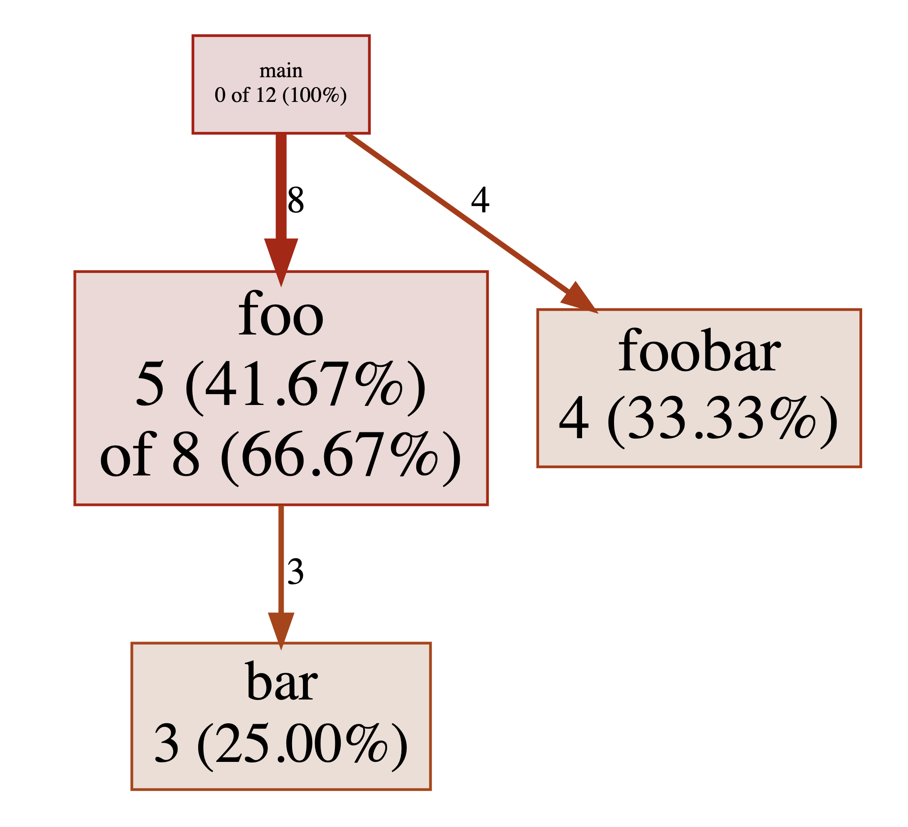

# pprofutils

pprofutils provides command line utilities for converting pprof files to Brendan Gregg's [folded text](https://github.com/brendangregg/FlameGraph#2-fold-stacks) format and vice versa.

## Install

pprofutils requires Go 1.16 and can be installed like this:

```
go install github.com/felixge/pprofutils/cmd/...
```

## Usage

Convert a pprof file to text:

```
pprof2text < ./test-fixtures/pprof.samples.cpu.001.pb.gz > example.txt
```

Convert a text file to pprof:

```
text2pprof < example.txt > example.pprof
```

## Tutorial: Generate a fake pprof profile

My primary use case for this tool is to quickly generate fake pprof profiles, mostly for creating educational content.

This can be done by simply creating a file called `profile.txt` with the following content:

```
main;foo 5
main;foo;bar 3
main;foobar 4
```

Then convert it to a pprof profile:

```
text2pprof < profile.txt > profile.pprof
```

And finally view it using pprof:

```
go tool pprof -http=:6060 profile.pprof
```

The resulting graphs should look like this:




## License

pprofutils is licensed under the MIT License.
