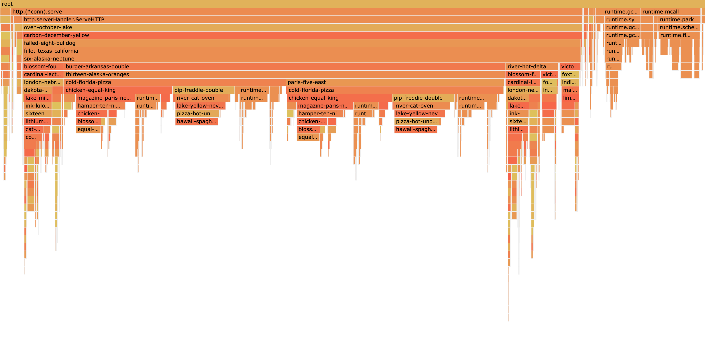
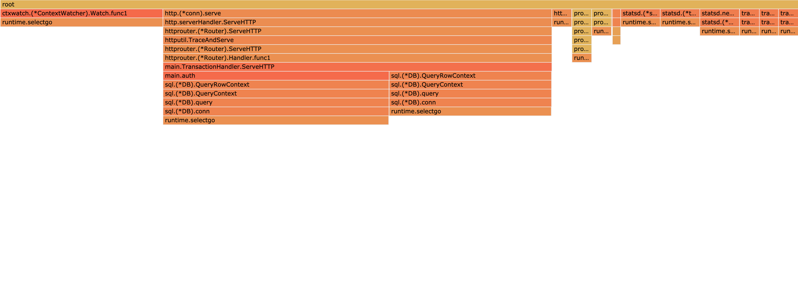
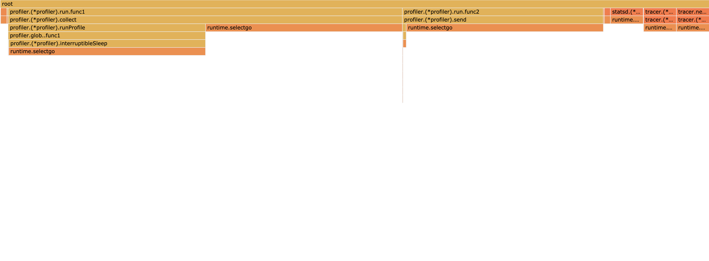
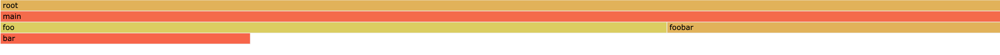
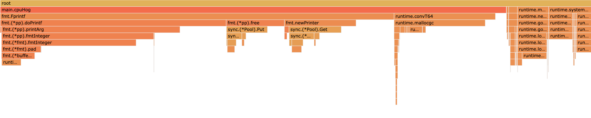
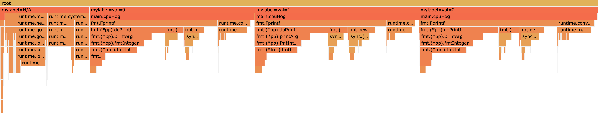

[](https://pkg.go.dev/github.com/felixge/pprofutils)
[](https://github.com/felixge/pprofutils/actions/workflows/go.yml?query=branch%3Amain)

# pprofutils

pprofutils is a swiss army knife for [pprof files](https://github.com/DataDog/go-profiler-notes/blob/main/pprof.md). You can use it as a command line utility or as a free web service.

- [**Install**](#install)
- [**Utilities**](#utilities): [anon](#anon) · [avg](#avg) · [folded](#folded) · [json](#json) · [labelframes](#labelframes) · [raw](#raw)
- [**Use Cases**](#use-cases): [Convert linux perf profiles to pprof](#convert-linux-perf-profiles-to-pprof)
- [**License**](#license)

## Install

pprofutils requires Go 1.16 and can be installed like this:

```
go install github.com/felixge/pprofutils/v2/cmd/pprofutils@latest
```

Alternatively you can use it as a free web service hosted at https://pprof.to.

## Utilities

### anon

Takes a pprof profile and anonymizes it by replacing pkg, file and function
names with human readable hashes. The whitelist can be used to prevent certain
packages from being anonymized.

TODO: Ignore all stdlib packages by default and maybe also popular OSS libs.

The input and output file default to "-" which means stdin or stdout.

#### Use anon utility via cli

```
pprofutils anon [-whitelist=<regex>] <input file> <output file>

FLAGS:
  -whitelist=^runtime;^net;^encoding Semicolon separated pkg name regex list
```

#### Use anon utility via web service

```
curl --data-binary @<input file> 'pprof.to/anon?whitelist=^runtime;^net;^encoding' > <output file>
```

#### Example 1: Anonymize a CPU profile
```shell
pprofutils anon examples/anon.in.pprof examples/anon.out.pprof
# or
curl --data-binary @examples/anon.in.pprof pprof.to/anon > examples/anon.out.pprof
```
Converts the profile [examples/anon.in.pprof](./examples/anon.in.pprof) that looks like this:


Into a new profile [examples/anon.out.pprof](./examples/anon.out.pprof) that looks like this:




### avg

Takes a block or mutex profile and creates a profile that contains the average
time per contention by dividing the nanoseconds or value in the profile by the
sample count value.

TODO: Support memory profiles.

The input and output file default to "-" which means stdin or stdout.

#### Use avg utility via cli

```
pprofutils avg <input file> <output file>
```

#### Use avg utility via web service

```
curl --data-binary @<input file> 'pprof.to/avg' > <output file>
```

#### Example 1: Convert block profile to avg time
```shell
pprofutils avg examples/avg.in.pprof examples/avg.out.pprof
# or
curl --data-binary @examples/avg.in.pprof pprof.to/avg > examples/avg.out.pprof
```
Converts the profile [examples/avg.in.pprof](./examples/avg.in.pprof) that looks like this:



Into a new profile [examples/avg.out.pprof](./examples/avg.out.pprof) that looks like this:




### folded

Converts pprof to Brendan Gregg's folded text format and vice versa. The input
format is automatically detected and used to determine the output format.

The input and output file default to "-" which means stdin or stdout.

#### Use folded utility via cli

```
pprofutils folded [-headers] <input file> <output file>

FLAGS:
  -headers=false Add header column for each sample type
```

#### Use folded utility via web service

```
curl --data-binary @<input file> 'pprof.to/folded?headers=false' > <output file>
```

#### Example 1: Convert folded text to pprof
```shell
pprofutils folded examples/folded.in.txt examples/folded.out.pprof
# or
curl --data-binary @examples/folded.in.txt pprof.to/folded > examples/folded.out.pprof
```
Converts [examples/folded.in.txt](./examples/folded.in.txt) with the following content:

```
main;foo 5
main;foo;bar 3
main;foobar 4
```

Into a new profile [examples/folded.out.pprof](./examples/folded.out.pprof) that looks like this:


#### Example 2: Convert pprof to folded text
```shell
pprofutils folded examples/folded.in.pprof examples/folded.out.txt
# or
curl --data-binary @examples/folded.in.pprof pprof.to/folded > examples/folded.out.txt
```
Converts the profile [examples/folded.in.pprof](./examples/folded.in.pprof) that looks like this:



Into a new folded text file [examples/folded.out.txt](./examples/folded.out.txt) that looks like this:

```
main;foo 5
main;foobar 4
main;foo;bar 3

```


### json

Converts from pprof to json and vice vera. The input format is automatically
	detected and used to determine the output format.

The input and output file default to "-" which means stdin or stdout.

#### Use json utility via cli

```
pprofutils json <input file> <output file>
```

#### Use json utility via web service

```
curl --data-binary @<input file> 'pprof.to/json' > <output file>
```

#### Example 1: Convert pprof to json
```shell
pprofutils json examples/json.in.pprof examples/json.out.json
# or
curl --data-binary @examples/json.in.pprof pprof.to/json > examples/json.out.json
```
See [examples/json.in.pprof](./examples/json.in.pprof) and [examples/json.out.json](./examples/json.out.json) for more details.
#### Example 2: Convert json to pprof
```shell
pprofutils json examples/json.in.json examples/json.out.pprof
# or
curl --data-binary @examples/json.in.json pprof.to/json > examples/json.out.pprof
```
See [examples/json.in.json](./examples/json.in.json) and [examples/json.out.pprof](./examples/json.out.pprof) for more details.


### labelframes

Adds virtual root frames for the each value of the selected pprof label. This
is useful to visualize label values in a flamegraph.

The input and output file default to "-" which means stdin or stdout.

#### Use labelframes utility via cli

```
pprofutils labelframes -label=<label> <input file> <output file>

FLAGS:
  -label=mylabel The label key to turn into virtual frames.
```

#### Use labelframes utility via web service

```
curl --data-binary @<input file> 'pprof.to/labelframes?label=mylabel' > <output file>
```

#### Example 1: Add root frames for pprof label values
```shell
pprofutils labelframes examples/labelframes.in.pprof examples/labelframes.out.pprof
# or
curl --data-binary @examples/labelframes.in.pprof pprof.to/labelframes > examples/labelframes.out.pprof
```
Converts the profile [examples/labelframes.in.pprof](./examples/labelframes.in.pprof) that looks like this:



Into a new profile [examples/labelframes.out.pprof](./examples/labelframes.out.pprof) that looks like this:




### raw

Converts pprof to the same text format as go tool pprof -raw.

The input and output file default to "-" which means stdin or stdout.

#### Use raw utility via cli

```
pprofutils raw <input file> <output file>
```

#### Use raw utility via web service

```
curl --data-binary @<input file> 'pprof.to/raw' > <output file>
```

#### Example 1: Convert pprof to raw
```shell
pprofutils raw examples/raw.in.pprof examples/raw.out.txt
# or
curl --data-binary @examples/raw.in.pprof pprof.to/raw > examples/raw.out.txt
```
See [examples/raw.in.pprof](./examples/raw.in.pprof) and [examples/raw.out.txt](./examples/raw.out.txt) for more details.


## Use Cases

### Convert linux perf profiles to pprof

Convert a Linux `perf.data` profile to `pprof`, via Brendan Gregg's [`stackcollapse-perf.pl`](https://github.com/brendangregg/FlameGraph/blob/master/stackcollapse-perf.pl) script:

```bash
perf script | stackcollapse-perf.pl | pprofutils folded > perf.pprof
```

## License

pprofutils is licensed under the MIT License.
